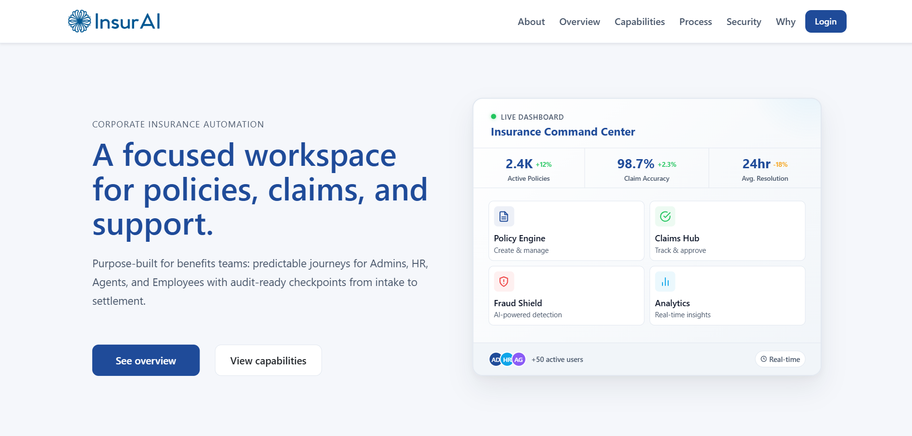
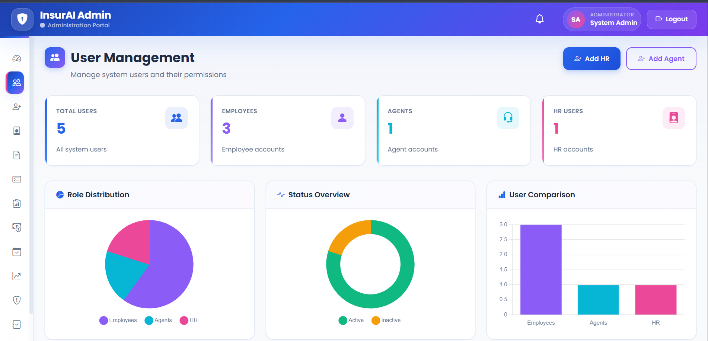
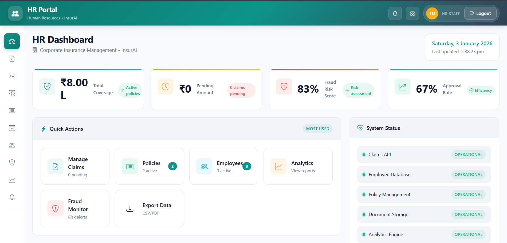
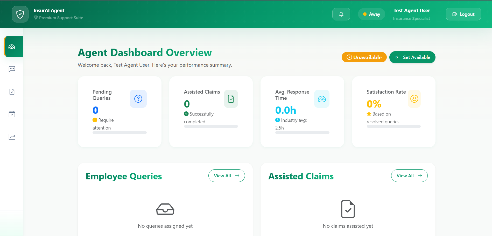
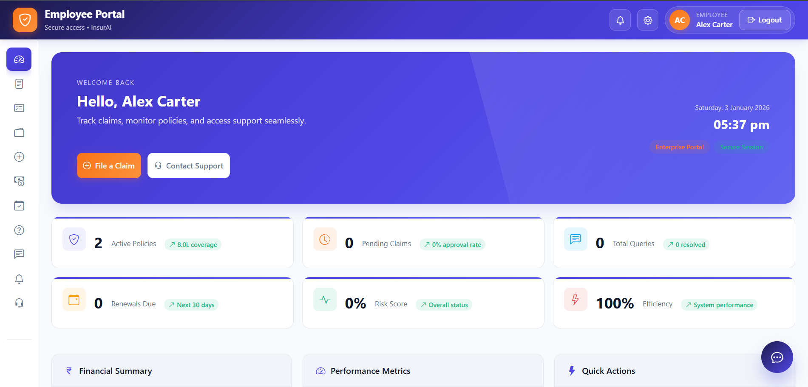

# InsurAI

**Enterprise Insurance Policy Management & Claims Processing System**

[](https://openjdk.org/)
[](https://spring.io/projects/spring-boot)
[](https://react.dev/)
[](https://www.mysql.com/)
[](LICENSE)

A full-stack corporate insurance management platform featuring role-based access control, AI-powered assistance, automated fraud detection, and real-time claims processing. Built with Spring Boot and React to handle enterprise-scale policy administration.

## Table of Contents

- [Screenshots](#screenshots)
- [Key Features](#key-features)
- [Tech Stack](#tech-stack)
- [System Architecture](#system-architecture)
- [API Reference](#api-reference)
- [Security Implementation](#security-implementation)
- [Database Schema](#database-schema)
- [Contributing](#contributing)
- [License](#license)

## Screenshots

### Landing Page


*Corporate Insurance Automation homepage with an overview of capabilities.*

### Admin Dashboard – User Management


*Full system access: manage Employees, Agents, and HR users with role distribution charts.*

### HR Portal Dashboard


*Claims management, fraud monitoring, policy tracking, and quick-action shortcuts.*

### Agent Dashboard


*Real-time query queue, assisted claims tracking, and availability controls.*

### Employee Portal Dashboard


*Personal overview of active policies, pending claims, queries, and financial summary.*

---

## Key Features

| Category | Features |
|----------|----------|
| **Authentication** | JWT-based stateless auth, 4-tier role hierarchy (Admin, HR, Agent, Employee), BCrypt password hashing |
| **Claims Processing** | End-to-end claim lifecycle management, automated fraud detection, load-balanced HR assignment |
| **Policy Management** | CRUD operations for insurance policies, document uploads via Supabase S3, coverage tracking |
| **AI Integration** | Cohere-powered chatbot for employee queries, context-aware responses using policy data |
| **Notifications** | Real-time in-app notifications, claim status updates, query resolution alerts |
| **Audit & Compliance** | Complete audit logging, activity trails, fraud flagging with reason tracking |

## Tech Stack

### Backend
| Technology | Purpose |
|------------|---------|
| Java 21 | Core language |
| Spring Boot 3.5.5 | Application framework |
| Spring Security | Authentication & authorization |
| Spring Data JPA | Data persistence |
| MySQL | Primary database |
| Maven | Build & dependency management |

### Frontend
| Technology | Purpose |
|------------|---------|
| React 18 | UI framework |
| Vite | Build tool |
| React Router | Client-side routing |

### External Services
| Service | Purpose |
|---------|---------|
| Supabase S3 | Document storage |
| Cohere API | AI chatbot |
| SMTP | Email notifications |

## System Architecture

```
┌─────────────────────────────────────────────────────────────────┐
│                        React Frontend                           │
└─────────────────────────────┬───────────────────────────────────┘
                              │ REST API
┌─────────────────────────────▼───────────────────────────────────┐
│                      Spring Boot Backend                        │
│  ┌──────────────────────────────────────────────────────────┐   │
│  │  Security Layer: JWT Filters (Employee/Agent/HR/Admin)   │   │
│  └──────────────────────────────────────────────────────────┘   │
│  ┌─────────────┐  ┌─────────────┐  ┌─────────────────────────┐  │
│  │ Controllers │  │  Services   │  │     Repositories        │  │
│  │  (REST)     │──│  (Business) │──│       (JPA)             │  │
│  └─────────────┘  └─────────────┘  └─────────────────────────┘  │
└─────────────────────────────┬───────────────────────────────────┘
                              │
┌─────────────────────────────▼───────────────────────────────────┐
│                         MySQL Database                          │
└─────────────────────────────────────────────────────────────────┘
```

## API Reference

### Authentication Endpoints

| Method | Endpoint | Description | Access |
|--------|----------|-------------|--------|
| POST | `/auth/register` | Employee registration | Public |
| POST | `/auth/login` | Employee login | Public |
| POST | `/admin/login` | Admin login | Public |
| POST | `/hr/login` | HR login | Public |
| POST | `/agent/login` | Agent login | Public |

### Core Endpoints

| Method | Endpoint | Description | Access |
|--------|----------|-------------|--------|
| GET | `/employee/policies` | List available policies | Employee |
| POST | `/employee/claims` | Submit insurance claim | Employee |
| GET | `/employee/claims` | View submitted claims | Employee |
| POST | `/employee/chatbot` | AI chatbot interaction | Employee |
| GET | `/hr/claims` | View pending claims | HR |
| POST | `/hr/claims/approve/{id}` | Approve/Reject claim | HR |
| GET | `/admin/users` | Manage all users | Admin |
| GET | `/admin/audit-logs` | View audit trail | Admin |

> Full API documentation: [docs/api.md](docs/api.md)

## Security Implementation

### Authentication Flow

```
User Login → Credential Validation → JWT Generation → Token Response
     │
Subsequent Requests → Authorization Header (Bearer Token) → JWT Filter Validation → Access Granted/Denied
```

### Role-Based Access Control

| Role | Permissions |
|------|-------------|
| **Admin** | Full system access, user management, audit logs, policy CRUD |
| **HR** | Claims approval/rejection, fraud review, employee management |
| **Agent** | Query handling, availability management |
| **Employee** | Policy viewing, claim submission, chatbot access |

### Security Measures

- Stateless JWT authentication with role-based claims
- BCrypt password hashing (strength factor: 12)
- CORS configured for allowed origins only
- Role-specific JWT authentication filters
- Request validation and sanitization

## Database Schema

### Core Entities

| Entity | Description | Key Relationships |
|--------|-------------|-------------------|
| `Employee` | Employee accounts and profiles | Has many Claims, Queries |
| `Policy` | Insurance policy definitions | Has many Claims |
| `Claim` | Insurance claims with status tracking | Belongs to Employee, Policy |
| `Notification` | System notifications | Belongs to User |
| `AuditLog` | Activity audit trail | Records all system events |

### Entity Relationship Overview

```
Employee ──┬── Claims ──── Policy
           │
           └── Queries ─── Agent
                              │
                              └── AgentAvailability

Admin/HR ──── AuditLogs
```

## Project Structure

```
InsurAI-Project/
├── InsurAI-backend/
│   └── src/main/java/com/insurai/
│       ├── config/          # Security, JWT, CORS configuration
│       ├── controller/      # REST API endpoints
│       ├── model/           # JPA entities
│       ├── repository/      # Data access layer
│       └── service/         # Business logic
│
├── InsurAI-frontend/
│   └── src/
│       ├── components/      # Reusable UI components
│       ├── pages/           # Route-based page components
│       └── api.js           # API client configuration
│
└── docs/                    # Additional documentation
```

## Contributing

1. Fork the repository
2. Create a feature branch: `git checkout -b feature/your-feature`
3. Commit changes: `git commit -m 'Add your feature'`
4. Push to branch: `git push origin feature/your-feature`
5. Open a Pull Request

Please ensure your code follows the existing style conventions and includes appropriate tests.

## License

This project is licensed under the MIT License - see the [LICENSE](LICENSE) file for details.

---

**Version 2.0.0** | Last Updated: February 2026
